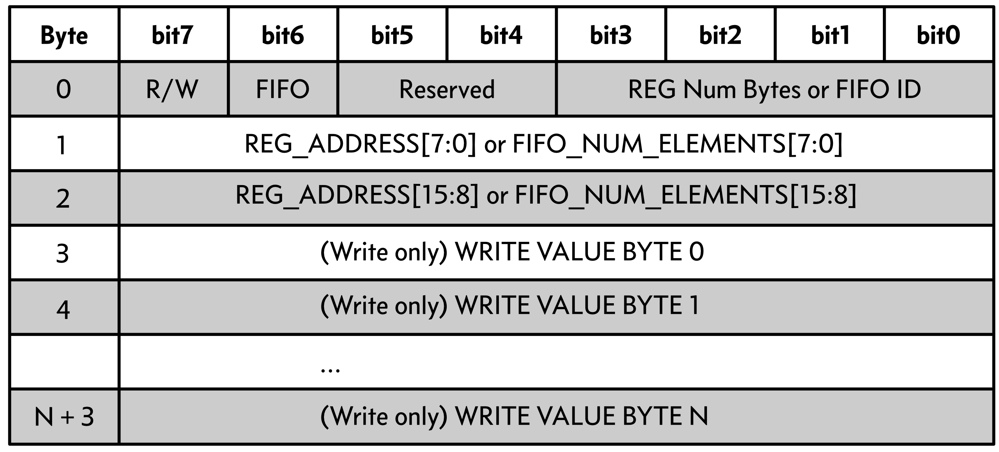

# FPGA Acceleration at the Edge

This repo is featured in an [Edge Analytics blog post](https://medium.com/edge-analytics/neural-network-on-the-tip-of-a-pencil-efd4c83ed36c). Take a look for a high-level description of the motivation for this work.

We are interested in HW accelerators at the edge, especially FPGAs. Development and deployment of non-CPU hardware is relatively high friction, particularly for software engineers and data scientists with limited experience with hardware, digital design, and HW accelerator-specific tooling. Ultimately, this is a big barrier for many teams that would otherwise greatly benefit from using FPGAs or other HW accelerators.

We want to see a future where general high-level synthesis (HLS) and application-specific generators reduce this friction and allow us to unify the exploitation of algorithmic and hardware structure.

In this repo, we show how we built a custom FPGA solution for a sleep tracking application based on a peer-reviewed [reference implementation](https://pubmed.ncbi.nlm.nih.gov/31579900/).

In addition to making FPGAs and other non-CPU hardware more accessible in terms of algorithm design and deployment, the process of gluing components together in a heterogenous compute environment has its own challenges and friction. We also want to see tools that help make this robust, safe, and ergonomic (device drivers, automatic code generation, DSLs, etc.). We believe the powerful type system and static checks of the [Rust programming language](https://www.rust-lang.org/) can help a lot in these endeavors.

# What is in this Repo

*Fig 1: High level diagram for the custom FPGA sleep application implemented in this repo.*

1. Data and models used to train and verify the sleep tracker application in [data](data) and [models](models).
2. A custom FPGA sleep tracker application in [fpga](fpga).
3. A CPU-land FPGA driver built in Rust in [host](host).

The Rust FPGA driver can be used to program FPGA data acquisition sessions and receive data back per a simple API. Furthermore, a custom packet protocol was developed for communication between the host and FPGA. A [CLI binary](host/src/bin.rs) is available and examples can be found in [host/examples](host/examples).

# Technical Overview

We implemented an FPGA application capable of running a sleep tracking application autonomously (from sampling a connected accelerometer to storing predictions into memory), but we do want to be able to externally start FPGA sessions and eventually pull data off of the FPGA. This gets us to the common paradigm of a paired CPU (*e.g.*, MCU) host and FPGA accelerator. Furthermore, for testing and validation purposes, we needed to pipe labeled test data through the
FPGA neural network core from a host (bypassing the accelerometer sampling).

## Custom FPGA Stack

We chose the [Lattice ICE40 UP](https://www.latticesemi.com/en/Products/FPGAandCPLD/iCE40UltraPlus) as our FPGA hardware base. The ICE40 UP is a small FPGA (packages as small as ~2mm x 2mm) designed for low-power ML applications.

We rolled our own implementation for each component in the FPGA stack directly in SystemVerilog with limited dependency on vendor libraries and compiler specifics. We did this for a few of reasons:

- Provide a largely vendor-independent solution.
- Show what building a "2D algorithm" in an FPGA looks like.
- Build efficient application-specific components with only exactly what we need (UART, NN core), and see how efficient we could be in terms of FPGA fabric usage.

In the following subsections, we briefly describe the major components of the stack shown in FIG 1. The FPGA source code for our solutions can be found in [fpga](fpga) and the host source code can be found in [host](host).

### Getting IMU Data

In development, we used two Lattice development kits (the [mobile development platform](http://www.latticesemi.com/products/developmentboardsandkits/ice40ultraplusmobiledevplatform) and the [wearable development platform](http://www.latticesemi.com/products/developmentboardsandkits/ice40ultrawearabledevelopmentplatform)). Both of these contain integrated 6-axis IMUs (accelerometer and gyroscope). For operating in autonomous mode (as opposed to being fed pre-existing data from a host), we implemented an IMU sampler core on the FPGA responsible for interacting with the IMU sensor chips, bandpass filtering the data, and forwarding the data stream to the featurizer implementation.

### Featurizing the Sensor Data

Following a [reference implementation](https://pubmed.ncbi.nlm.nih.gov/31579900/), we featurize raw accelerometer data into actigraphy counts. For initial validation on pre-existing test data, we also included the heart rate and clock proxy features, calculated from the reference data sets per the methods described in the reference paper.

### The Feedforward Neural Network Core

The most important FPGA module is our custom neural network core (NN core). Our NN Core is defined parametrically [in SystemVerilog](fpga/source/nn/nn.sv) so that we can modify the number of layers, weights, and biases in the top-level and recompile for different concrete nets. However, a highly generalized NN core was not our goal. There are number of constraints:

- Only support fully-connected feedforward networks.
- Max 256 layers.
- Max 256 neurons per layer.
- Only the ReLU activation function is supported.
- 32 bit fixed point (`I16F16`) input and output data type.
- 16 bit fixed point data type (`I2F14`) for model parameters (weights and biases).

When validating the NN Core with labeled data from the reference paper, we used our core to instantiate a 3-input, 3 hidden layer, 15 elements-per-hidden-layer, and 3-output network. This network processes a three-vector of featurized input data at a time (activity count, heart rate, clock proxy). For free-running applications, we used an NN core with only a single input feature (activity count) calculated from the sampled accelerometer data.

### Communicationg with the Outside World

We developed a custom UART communication core using RS-232 signal levels to communicate with attached hosts. We also defined a simple packet protocol and register map. Based on this, we developed a host device driver to control the FPGA based on the defined protocol, e.g., to start data acquisition and pull data off of the FPGA. See [Custom Packet Protocol for Communication](#custom-packet-protocol-for-communication) below for more details on the custom packet protocol.

### The Top-Level Controller

To make everything work, we implemented the ubiquitous [top-level controller](fpga/source/top.sv) and state machine logic that waits for external commands and orchestrates the internal activities during a NN core computation and buffering data to memory.

## Pipeline and Protocols

### Keras to FPGA NN Core

We developed a pipeline to go from training a Keras model as defined in the reference implementation to the inputs needed for the deployed FPGA solution. Major components:

- Training or obtaining a Keras model with kernel constraints (maximum parameter values).
- Script to parse a Keras HDF5 output creating two memory initialization files biases.mif and weights.mif, as well as a Systemv Verilog package file containing required parameters expected by the NN core.

*Fig 2: Model deploy pipeline from Keras model to NN Core instantiation.*

### Custom Packet Protocol for Communication

To communicate to and from the FPGA, we created a simple custom packet protocol to be used in conjunction with, for example, RS-232 communication over a serial port. The custom packet requires a single byte header that specifies information about the transaction (read/write, register or FIFO target, etc.). Depending on the kind of transaction, subsequent bytes provide the target FPGA register address or the number of bytes to pull from the FIFO and then a payload of bytes in the case of a write packet. See Table 1 below for the bit-level details.

*Table 1: The custom packet protocol we defined for host <-> FPGA communication.*

## Host Driver

We built a host-side [Rust driver](host/src/lib.rs) that implements the custom protocol interface to communicate with the FPGA and pull accumulated data after a monitoring session. The [low-level communication packet protocol details](host/src/protocol.rs) are wrapped with a [higher-level typesafe and ergonomic Session API](host/src/session.rs), which we used to drive the FPGA with the [CLI binary](host/src/bin.rs) and as demonstrated in [examples](host/examples).
