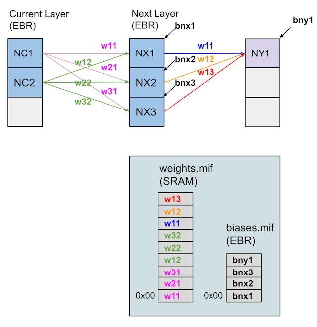
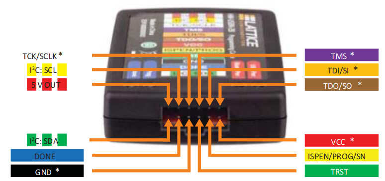
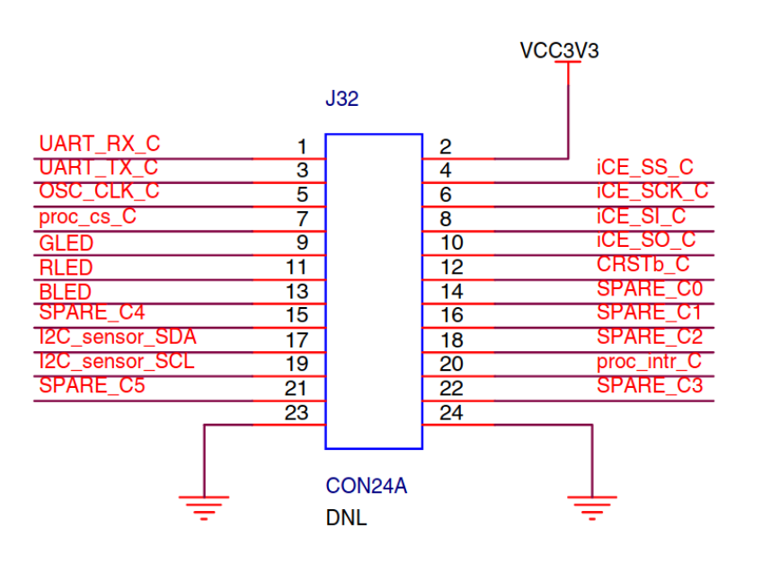

# Sleep Tracker FPGA Overview
We did our initial prototyping and deployment work with the [iCE40 UltraPlus MDP](https://www.latticesemi.com/en/Products/DevelopmentBoardsAndKits/iCE40UltraPlusMobileDevPlatform). This development platform was ideal since we had access to the LIS2D12 accelerometer to use for the actigraphy calculations required by the sleep tracker classifier. The iCE40UP5K had sufficient on chip Embedded Block RAM (EBR) 120Kb to deploy small neural net models with less than 5K parameters. We used the EBRs to store the parameters since memory initialization files allowed the parameters to be loaded on device initialization. We additionally used the onboard 256Kb SRAM to log the actigraphy counts and sleep, wake predictions to perform validation of the trained model on the deployed system.

## Sleep Tracker Testing
To run the top level testbench for the sleep tracker fpga code you must first generate the System Verilog dependencies from the provided [Keras model parser](source/nn/keras_to_sv.py).
```
cd source/nn
python keras_to_sv.py -i ../../../models/sleep_wake.h5 -o ./
```

After these dependencies have been created you can navigate to the test directory and run make which will execute the cocotb [top_tb.py](test/top_tb.py) testbench.


### NN Block Diagram




### Verilator Cocotb Requirements
Verilator can typically be installed on macosx with the following command

```brew install verilator```

Currently cocotb version v1.5.1 was hanging with verilator versions > v4.106

### Modelsim Cocotb Requirements

Modelsim must use a 32bit arch with cocotb.

Ubuntu conda 32 bit env creation steps: 
```
conda create -n py3_32
conda activate py3_32
conda config --env --set subdir linux-32
conda install python=3 gxx_linux-32
pip install cocotb
```

## Pinouts
### HW-USBN-2B Pinout


### iCE40 UltraPlus Mobile Development Pinout - FPGA C
  
&nbsp;

### Suggested JTAG Pin Mapping
| USBN  | MDP J32       | ICE40 PIN  | ICE40 Net  | Wire Color |
| ----- | ------------- | ---------- | ---------- | ---------- |
| VCC   | 2: VCC        | NA         | NA         | Red        |
| TDO   | 15: SPARE_C4  | E4         | TDO        | Brown      |
| TDI   | 14: SPARE_C0  | C3         | TDI        | Orange     |
| TMS   | 16: SPARE_C1  | B1         | TMS        | Purple     |
| TCK   | 22: SPARE_C3  | F4         | TCLK       | White      |
| GND   | 24: GND       | NA         | NA         | Black      |  
&nbsp;

## JTAG FPGA Clock
6MHz clock will work with appropriate JTAG clock constraints as below  
&nbsp;
## Contraints File Additions
Need to constrain the JTAG clock and set false paths as such: 
&nbsp;
```
create_clock -name {mytck} -period 366.3003663 [get_ports JTAG_TCK]
create_clock -name {clk} -period 166.6666667 [get_pins OSCInst0/CLKHF] 
set_false_path -from {mytck} -to {clk}
set_false_path -from {clk} -to {mytck}
```

## Running Reveal Session
1. Compile and export bin file in radiant
2. Open Reveal Analyzer Startup Wizard
- Create a new file
- Detect USB Port
  - Select LATTICE HW-USBN-2B
- Select RVL source 


## UART Pin Constraints

The mobile development platform has a FT223H USB to uart chip. Based on the mapping on the PCB the UART_RX_C next should be used to connect into the FPGA uart receive rx signal; This is Pin A2 for FPGA_C. Pin A1 should be connected to the uart tx output from the FPGA toplevel module. The constraints to do this is shown below.

```
ldc_set_port -iobuf {PULLMODE=100K} [get_ports rx]
ldc_set_location -site {A1} [get_ports tx]
ldc_set_location -site {A2} [get_ports rx]
```
